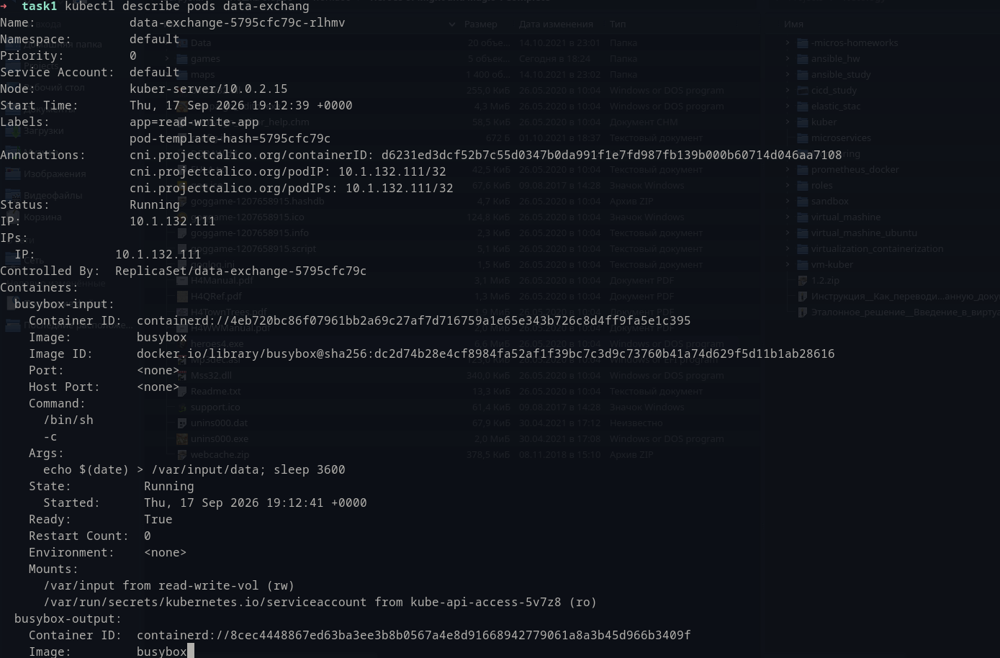
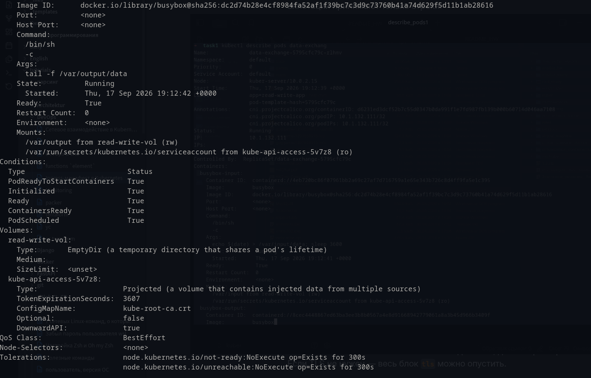
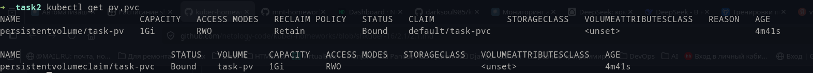
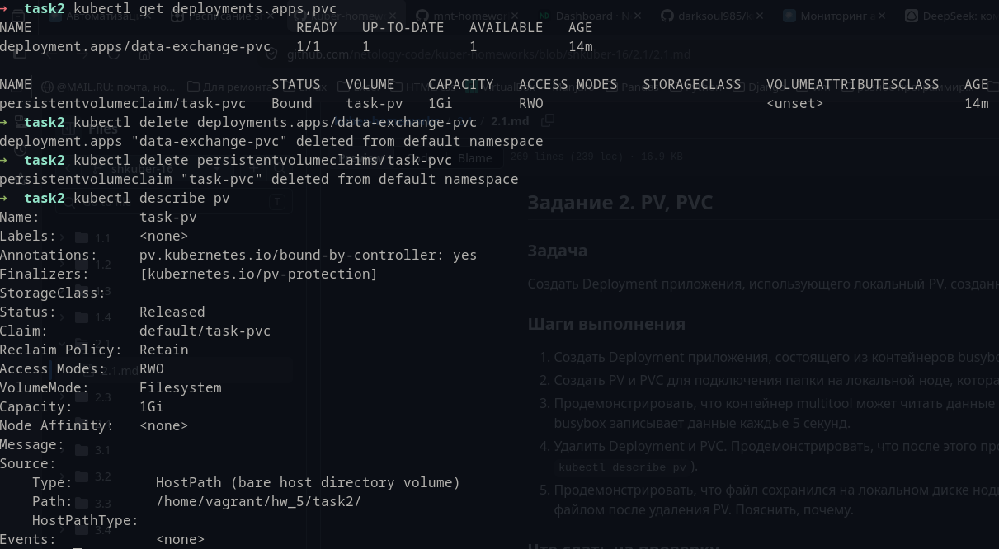
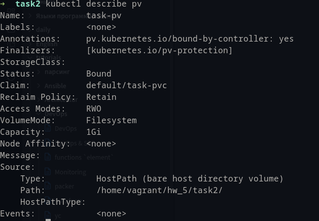
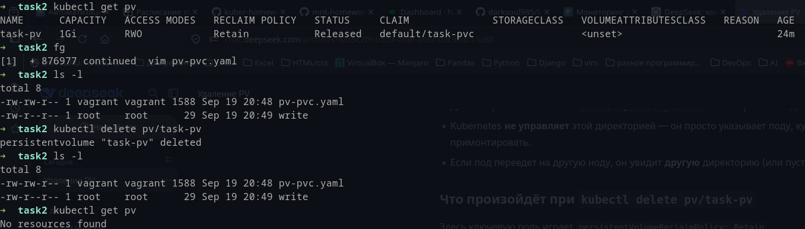
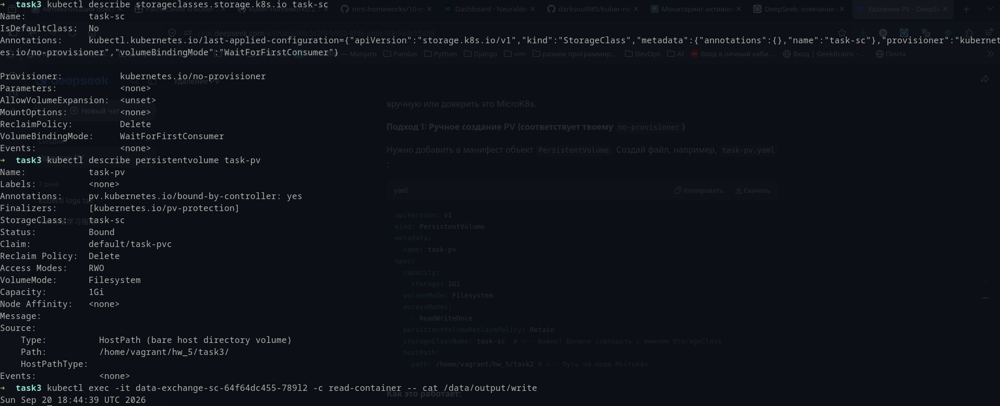

# Задание 1. Volume: обмен данными между контейнерами в поде

Манифест:

Скриншоты:

# Задание 2. PV, PVC

PV и PVC подключеные к папке на локальной ноде:

Контейнер multitool может читать данные из файла в смонтированной директории:

Удалены Deployment и PVC:

Объяснение: PV — это ресурс кластера, представляющий собой фрагмент реального хранилища. PV существует независимо от Pod.
После удаления PVC, PV приобретает `Status: Released`, т.е. сообщает что с данным PV нет связанных PVC.
При подключении же статус меняется на `Bound`:

Даже после удаления PV данные сохраняются на диске, если параметр `persistentVolumeReclaimPolicy` установлен в значении `Retain`:

Манифесты:

[pv-pvc.yaml](pv-pvc.yaml)

# Задание 3. StorageClass

Задача

Создан Deployment приложения, использующего PVC, созданный на основе StorageClass.

Манифесты:

[sc.yaml](sc.yaml)
