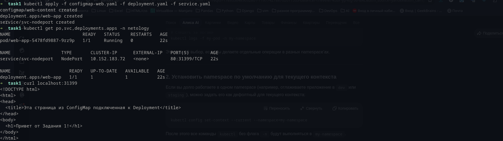
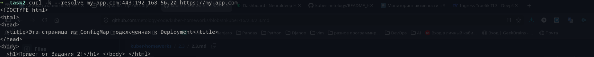
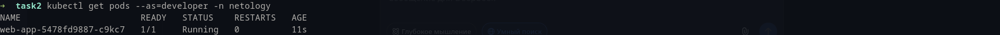

# Задание 1: Работа с ConfigMaps

Не стал заморачиваться с multitool, прокинул NodePort в сервисе для проверки подключения ConfigMap:



Манифесты:

[deployment.yaml](deployment.yaml)

[configmap-web.yaml](configmap-web.yaml)

# Задание 2: Настройка HTTPS с Secrets

Манифесты:

[secret-tls.yaml](secret-tls.yaml)

[ingress-tls.yaml](ingress-tls.yaml)

Скриншот вывода curl -k:



# Задание 3: Настройка RBAC

Команды генерации сертификатов:

```
openssl genrsa -out developer.key 2048

openssl req -new -key developer.key -out developer.csr -subj "/CN=developer"

sudo openssl x509 -req -in developer.csr -CA /var/snap/microk8s/current/certs/ca.crt -CAkey /var/snap/microk8s/current/certs/ca.key -CAcreateserial -out developer.crt -days 365
```

Скриншот проверки прав:



Манифесты:

[role-pod-reader.yaml](role-pod-reader.yaml)

[rolebinding-developer.yaml](rolebinding-developer.yaml)
