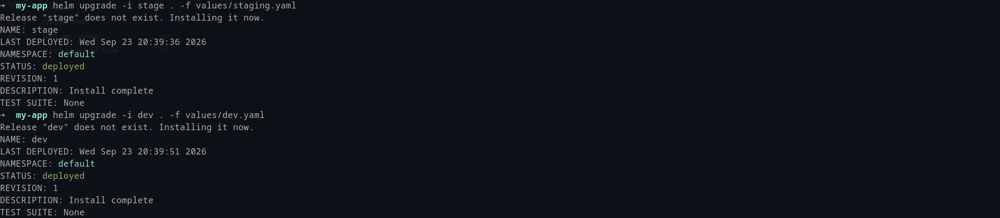
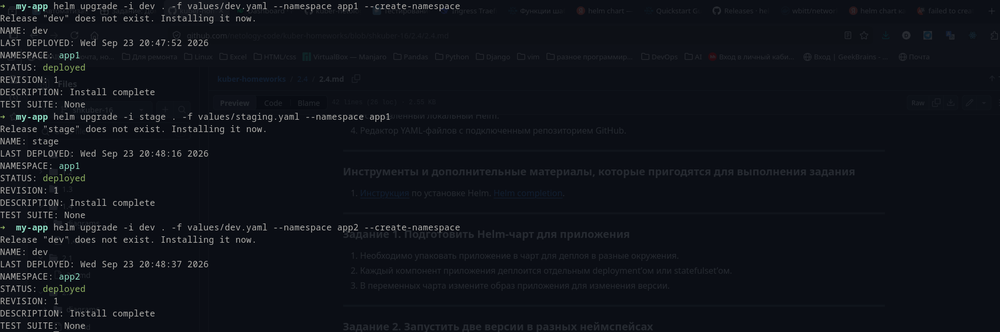
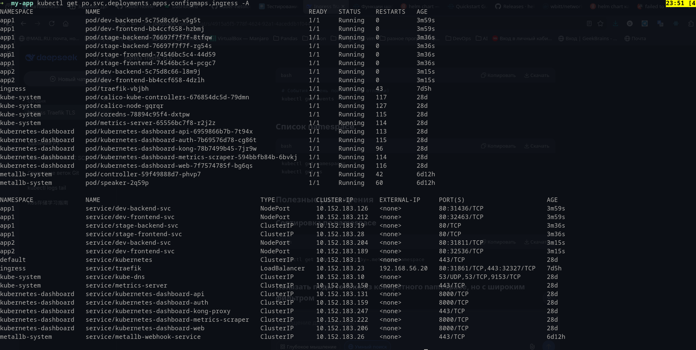
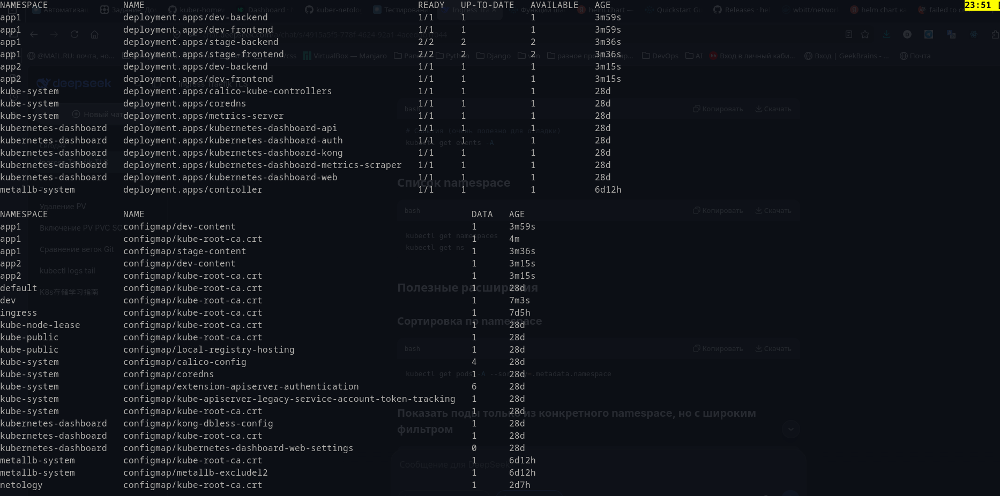
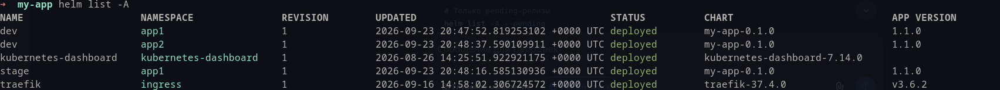

# Задание 1. Подготовить Helm-чарт для приложения

Упакованное в чарт приложение:

[my-app](my-app)

Запуск приложения с разными образами прописанными в настройках.

# Задание 2. Запустить две версии в разных неймспейсах

Запуск нескольких приложений в одном и нескольких namespace:

