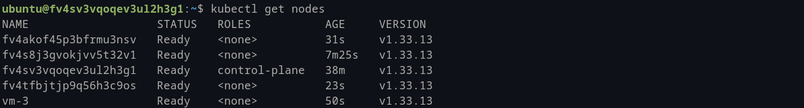
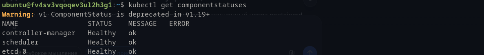
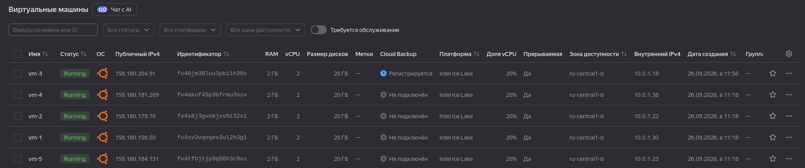

# Домашнее задание к занятию «Установка Kubernetes»

В связи с ограничением времени до закрытия модуля сделал только основное задание.
Установка была в учебных целях проведена вручную, поэтому манифесты не прикладываю.

`kubectl get nodes`:

`kubectl get components`:

VPC list:

