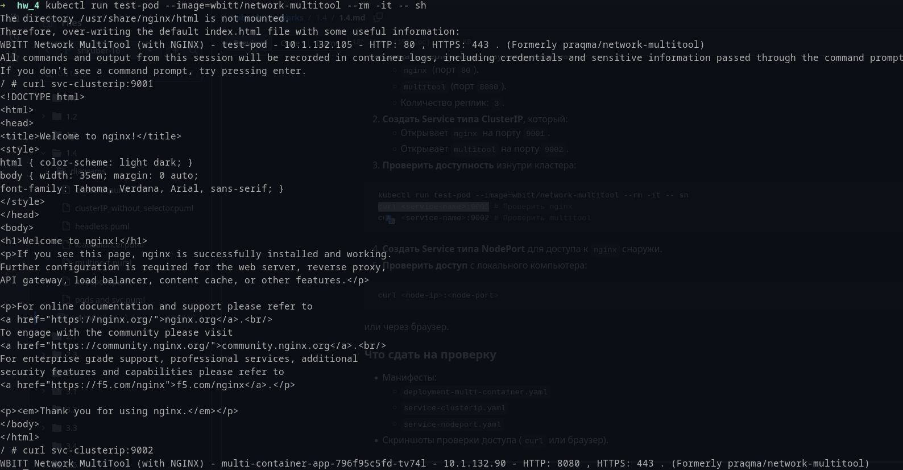
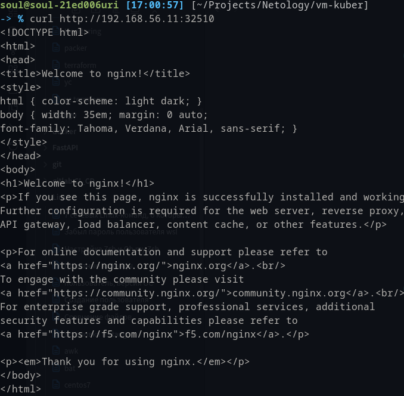
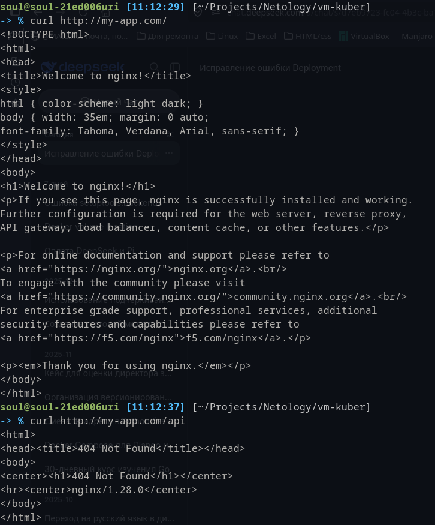

# Задание 1: Настройка Service (ClusterIP и NodePort)

Доступ к сервису с ClusterIP:

Доступ к сервису с NodePort хоста:

Манифесты:
[deployment-multi-container](deployment-multi-container.yaml)
[service-clusterip](service-clusterip.yaml)
[service-nodeport](service-nodeport.yaml)

# Задание 2: Настройка Ingress

Curl запросы к сервисам:

Насколько я понял, в случае с запросом /api, так как wbitt/network-multitool nginx внутри не является полноценным маршрутизатором, из за чего и возвращается 404 от nginx внутри контейнера.

Манифесты:
[deployment-frontend](deployment-frontend.yaml)
[deployment-backend](deployment-backend.yaml)
[service-frontend](service-frontend.yaml)
[service-backend](service-backend.yaml)
[ingress](ingress.yaml)
