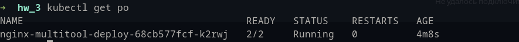
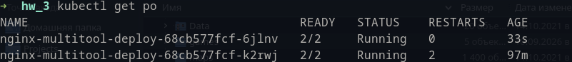
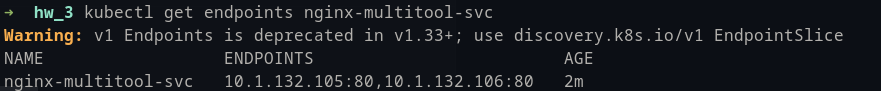
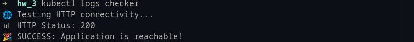
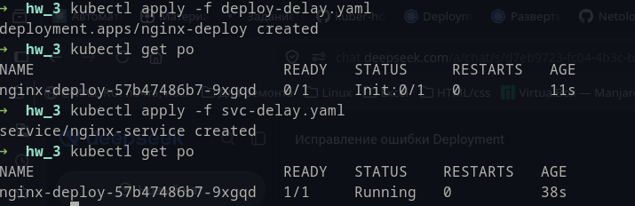

# 1. Задание 1. Создать Deployment и обеспечить доступ к репликам приложения из другого Pod

Запущен Depluyment с одной репликой:

Запущен Depluyment с двумя репликами:

deployment - [[dpl_ng_multitool.yaml]]

Создан сервис для доступа к репликам приложений:

service - [[service.yaml]]

Создан отдельный Pod с приложением curl и проверен доступ к приложениям:

checker - [[checker.yaml]]

# Задание 2. Создать Deployment и обеспечить старт основного контейнера при выполнении условий

Nginx не стартует при отключенном сервисе. Стартует после запуска Service:

deployment - [[deploy-delay.yaml]]
service - [[svc-delay.yaml]]
