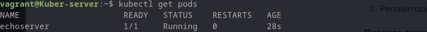
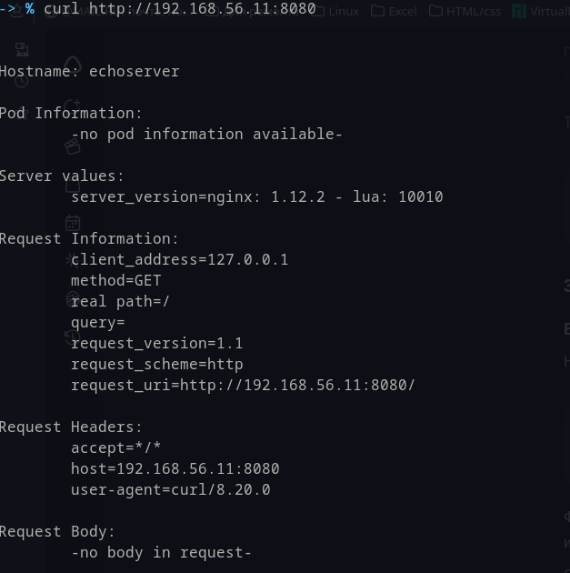
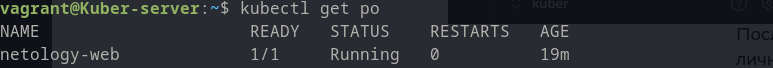
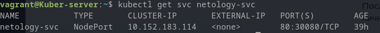
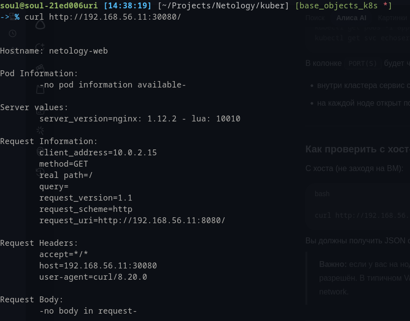

# 1. Задание

`kubectl get pods`:

Манифест - [[echoserver.yaml]]

`kubectl port-forward`:
![[port_forward_echoserver.png]]

Проверка работы echoserver:

# 2. Задание

Манифесты:

1. Pod - [netology-web](netology-web.yaml)
2. Service - [netology-svc](netology-svc.yaml)
